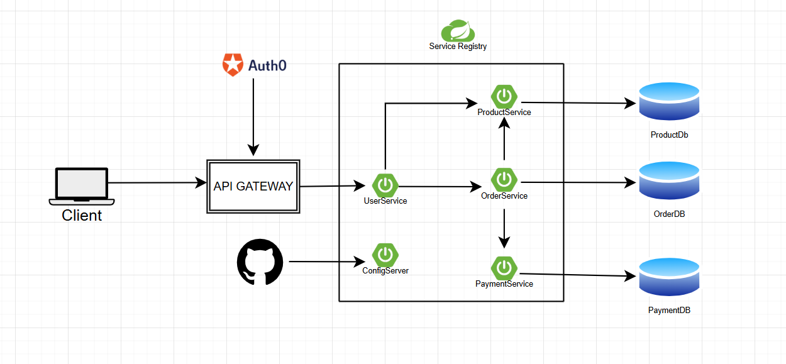

# Product Service Microservices

## Overview
This project is an implementation of an Invoice management system. It includes core functionalities such as invoice creation, retrieval, update, deletion, status management, and filtering. The system is built using an in-memory H2 database but can be easily connected to MySQL or any other relational database.

## Tech Stack
- **Framework:** Spring Boot 3.2.2
- **Language:** Java 17
- **Database:** H2 (in-memory, default)
- **ORM:** Spring Data JPA / Hibernate
- **Build Tool:** Maven
- **Logging:** Log4j2
- **Code Generation:** Lombok

## Features Implemented

1. **Invoice Creation**
    - Create a new invoice with product details, quantity, and amount
    - Auto-assigns status as `CREATED` and timestamps the invoice

2. **Invoice Retrieval**
    - Get all invoices
    - Get a specific invoice by ID

3. **Invoice Update**
    - Update invoice details (amount, product details, product ID, quantity)
    - Update invoice status independently via PATCH endpoint

4. **Invoice Deletion**
    - Delete a specific invoice by ID
    - Delete all invoices (bulk delete)

5. **Invoice Filtering**
    - Filter invoices by status
    - Filter invoices by product ID

6. **Additional Operations**
    - Get total invoice count

7. **Error Handling**
    - Custom exception handling with global exception handler
    - Structured error responses with error codes and HTTP status mapping

## Prerequisites
- Java (JDK 17 or later)
- Maven

## Setup & Running the Application

1. **Clone the Repository:**
   ```sh
   git clone https://github.com/sibashish726/InvoiceService.git
   cd InvoiceService
   ```

2. **Build the Application:**
   ```sh
   ./mvnw clean install
   ```

3. **Run the Application:**
   ```sh
   ./mvnw spring-boot:run
   ```
   The application starts on **port 8090**.

4. **Access the H2 Database Console:**
   - URL: [http://localhost:8090/h2-console](http://localhost:8090/h2-console)
   - JDBC URL: `jdbc:h2:mem:inoice_db`
   - Username: Set your own username in application.properties 
   - Password: Set your own password in application.properties 

## API Endpoints

Base path: `/v1/invoice`

| Method | Endpoint | Description |
|--------|----------|-------------|
| GET | `/v1/invoice/home` | Home page |
| POST | `/v1/invoice/saveInvoice` | Create a new invoice |
| GET | `/v1/invoice/getAllInvoices` | Get all invoices |
| GET | `/v1/invoice/getInvoiceById/{invoiceId}` | Get invoice by ID |
| PUT | `/v1/invoice/updateInvoice/{invoiceId}` | Update an invoice |
| DELETE | `/v1/invoice/deleteInvoiceById/{invoiceId}` | Delete an invoice by ID |
| GET | `/v1/invoice/getInvoicesByStatus/{status}` | Get invoices by status |
| GET | `/v1/invoice/getInvoicesByProductId/{productId}` | Get invoices by product ID |
| PATCH | `/v1/invoice/updateInvoiceStatus/{invoiceId}` | Update invoice status |
| GET | `/v1/invoice/count` | Get total invoice count |
| DELETE | `/v1/invoice/deleteAllInvoices` | Delete all invoices |

### Request/Response Examples

- **Create Invoice:**
  ```http
  POST /v1/invoice/saveInvoice
  ```
  **Request Body:**
  ```json
  {
    "productId": "105",
    "productDetails": "High-performance iPhone",
    "quantity": 2,
    "amount": 40000
  }
  ```
  **Response:** `201 Created` with the invoice ID.

- **Update Invoice:**
  ```http
  PUT /v1/invoice/updateInvoice/{invoiceId}
  ```
  **Request Body:**
  ```json
  {
    "productId": "105",
    "productDetails": "iPhone 15 Pro - Titanium (Updated)",
    "quantity": 1,
    "amount": 45000
  }
  ```
  **Response:** `200 OK`

- **Update Invoice Status:**
  ```http
  PATCH /v1/invoice/updateInvoiceStatus/{invoiceId}?status=PAID
  ```
  **Response:** `200 OK`

- **Delete Invoice:**
  ```http
  DELETE /v1/invoice/deleteInvoiceById/{invoiceId}
  ```
  **Response:** `204 No Content`

- **Get Invoice by ID:**
  ```http
  GET /v1/invoice/getInvoiceById/{invoiceId}
  ```
  **Response:** `200 OK`
  ```json
  {
    "id": 1,
    "amount": 40000,
    "quantity": 2,
    "invoiceStatus": "CREATED",
    "invoiceDate": "2024-01-15T10:30:00Z",
    "productId": "105",
    "productDetails": "High-performance iPhone"
  }
  ```

- **Get All Invoices:**
  ```http
  GET /v1/invoice/getAllInvoices
  ```
  **Response:** `200 OK` with a list of invoice objects.

- **Get Invoices by Status:**
  ```http
  GET /v1/invoice/getInvoicesByStatus/{status}
  ```
  **Response:** `200 OK` with a list of matching invoice objects.

- **Get Invoices by Product ID:**
  ```http
  GET /v1/invoice/getInvoicesByProductId/{productId}
  ```
  **Response:** `200 OK` with a list of matching invoice objects.

- **Get Invoice Count:**
  ```http
  GET /v1/invoice/count
  ```
  **Response:** `200 OK` with the total count.

- **Delete All Invoices:**
  ```http
  DELETE /v1/invoice/deleteAllInvoices
  ```
  **Response:** `204 No Content`

### Error Response Format
```json
{
  "errorMessage": "Invoice with given id not found",
  "errorCode": "INVOICE_NOT_FOUND"
}
```

## Database Schema

### Entity: Invoice (Table: `INVOICE_ITEM`)

| Column | Type | Description |
|--------|------|-------------|
| `id` | long | Auto-generated primary key |
| `INVOICE_AMOUNT` | long | Invoice amount |
| `PRODUCT_DETAILS` | String | Product description |
| `PRODUCT_ID` | String | Product identifier |
| `QUANTITY` | long | Product quantity |
| `INVOICE_STATUS` | String | Invoice status (e.g., CREATED, PAID) |
| `INVOICE_DATE` | Instant | Timestamp of invoice creation |

### DTOs
- **InvoiceRequest** – Input DTO for creating/updating invoices (amount, productDetails, productId, quantity).
- **InvoiceResponse** – Output DTO returned by the API (includes id, invoiceStatus, invoiceDate, and all request fields).
- **ErrorResponse** – Error DTO returned on failures (errorMessage, errorCode).

## Design Patterns

1. **N-Tier (Layered) Architecture** – Controller → Service → Repository.
2. **Inversion of Control (IoC)** – Use of `@RequiredArgsConstructor` for constructor-based dependency injection.
3. **Data Transfer Object (DTO) Pattern** – Decouples the internal database entity (`Invoice`) from the API interface.
4. **Builder Pattern** – Used via Lombok's `@Builder` for readable object construction.
5. **Strategy Pattern (via Spring Data JPA)** – Spring Data JPA provides the SQL implementation at runtime.
6. **Singleton Pattern** – All Spring Beans (`@Service`, `@RestController`, `@Repository`) are singletons by default.

## Future Enhancements
- Implement role-based access control (RBAC)
- Implement caching for performance improvement
- Implement Monitoring using Spring Boot Actuator + Prometheus
- Implement Kafka for streaming and notification
- Add Swagger/OpenAPI documentation
- Add unit and integration tests

# High Level Design 

