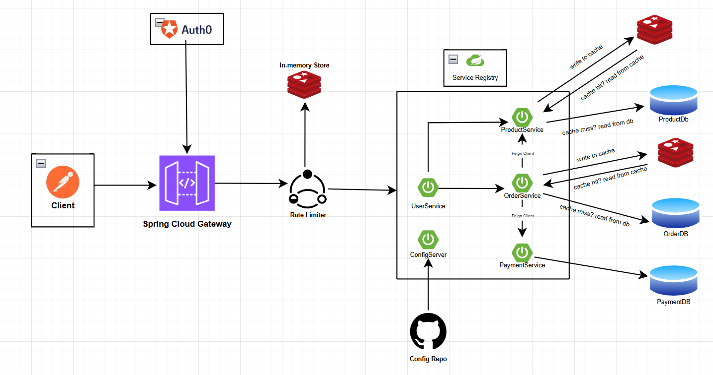

# ProductService Microservices

## Overview
ProductService is one of the services of an ShoppingCart system. It includes core functionalities such as product creation, retrieval, update, deletion,and filtering. The system is built using  MySQL can be migrated to any other relational database.


# High Level Design 



## Tech Stack
- **Framework:** Spring Boot 3.2.2
- **Language:** Java 17
- **Database:** MySQL
- **ORM:** Spring Data JPA / Hibernate
- **Build Tool:** Maven
- **Logging:** Log4j2
- **Code Generation:** Lombok
- **Caching:** Redis (docker image)

## Features Implemented

1. **Product Creation**
    - Create a new product details, quantity, and amount

2. **Product Retrieval**
    - Get all Product
    - Get a specific Product by ID

3.  **Product Deletion**
    - Delete a specific invoice by ID

4. **Error Handling**
    - Custom exception handling with global exception handler
    - Structured error responses with error codes and HTTP status mapping

## Prerequisites
- Java (JDK 17 or later)
- Maven

## Setup & Running the Application

1. **Clone the Repository:**
   ```sh
   git clone https://github.com/sibashish726/ProductService.git
   cd ProductService
   ```

2. **Build the Application:**
   ```sh
   ./mvnw clean install
   ```

3. **Run the Application:**
   ```sh
   ./mvnw spring-boot:run
   ```
   The application starts on **port 8080**.

4. **Access the My Database Console:**
   -JDBC URL: `jdbc:mysql://${DB_HOST:localhost}:3306/productdb`
   - Username: Set your own username in application.yaml 
   - Password: Set your own password in application.yaml 

## API Endpoints

Base path: `/product`
### Product Management API

| Method | Endpoint | Description |
|--------|----------|-------------|
| POST | `/product/addProduct` | Create and save a new product |
| GET | `/product/getProductById/{id}` | Get product details by ID |
| PUT | `/product/reduceQuantity/{id}` | Reduce the quantity of a specific product |
| DELETE | `/product/deleteProduct/{id}` | Delete a product by ID |
| GET | `/product/getAllProducts` | Get all products with pagination |

---

### Request/Response Examples

- **Add Product:**
  ```http
  POST /product/addProduct
  ```
  **Request Body:**
  ```json
  {
    "productName": "iPhone 15 Pro",
    "price": 99900,
    "quantity": 50
  }
  ```
  **Response:** `201 Created` with the product ID.

- **Get Product by ID:**
  ```http
  GET /product/getProductById/{id}
  ```
  **Response:** `200 OK`
  ```json
  {
    "productId": 105,
    "productName": "iPhone 15 Pro",
    "price": 99900,
    "quantity": 50
  }
  ```

- **Reduce Product Quantity:**
  ```http
  PUT /product/reduceQuantity/{id}?quantity=5
  ```
  **Response:** `200 OK`

- **Delete Product:**
  ```http
  DELETE /product/deleteProduct/{id}
  ```
  **Response:** `200 OK`

- **Get All Products:**
  ```http
  GET /product/getAllProducts?pageNumber=0&pageSize=5
  ```
  **Response:** `200 OK`
  ```json
  {
    "content": [
      {
        "productId": 105,
        "productName": "iPhone 15 Pro",
        "price": 99900,
        "quantity": 45
      }
    ],
    "pageable": {
      "pageNumber": 0,
      "pageSize": 5
    },
    "totalElements": 1,
    "totalPages": 1,
    "last": true
  }
  ```

### Error Response Format
```json
{
  "errorMessage": "Product with given id not found",
  "errorCode": "PRODUCT_NOT_FOUND"
}
```


## Database Schema

### Entity: Invoice (Table: `INVOICE_ITEM`)

| Column | Type | Description |
|--------|------|-------------|
| `PRODUCTID` | long | Auto-generated primary key |
| `PRODUCT_NAME` | String | Name of the product|
| `PRICE` | long | Unit price of the product |
| `QUANTITY` | long | Available stock quantity|


### DTOs

- **ProductRequest** – Input DTO for creating/adding products (`name`, `price`, `quantity`).
- **ProductResponse** – Output DTO returned by the API (includes `productId`, `productName`, `quantity`, and `price`).
- **ErrorResponse** – Error DTO returned on failures (`errorMessage`, `errorCode`).

## Design Patterns

1. **N-Tier (Layered) Architecture** – Controller → Service → Repository.
2. **Inversion of Control (IoC)** – Use of `@RequiredArgsConstructor` for constructor-based dependency injection.
3. **Data Transfer Object (DTO) Pattern** – Decouples the internal database entity (`Invoice`) from the API interface.
4. **Builder Pattern** – Used via Lombok's `@Builder` for readable object construction.
5. **Strategy Pattern (via Spring Data JPA)** – Spring Data JPA provides the SQL implementation at runtime.
6. **Singleton Pattern** – All Spring Beans (`@Service`, `@RestController`, `@Repository`) are singletons by default.

## Future Enhancements
- Implement role-based access control (RBAC)
- Implement caching for performance improvement
- Implement Monitoring using Spring Boot Actuator + Prometheus
- Implement Kafka for streaming and notification
- Add Swagger/OpenAPI documentation
- Add unit and integration tests
